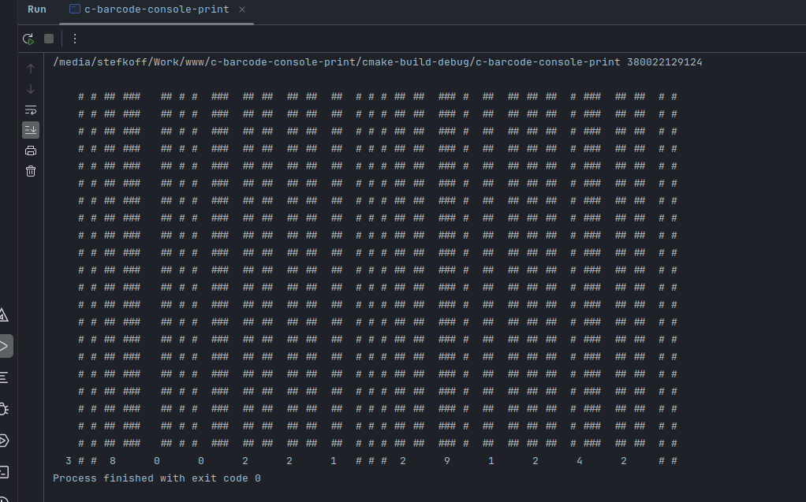

# c-barcode-console-print
Barcode Generator that is printed in the console (EAN-13 and UPC-a)

# Description
This code will generate a barcode representation for a given barcode number. 
Currently support barcodes are: EAN-13 and UPC-A

# Demo

# Build
1. mkdir build
2. cd build
3. cmake ..
4. make

# Run
./c-barcode-console-print [type] code

# TODO
1. Add --help(-h) argument to show the help message
2. Add option to allow custom height for the barcode printing
3. Lear how to print other barcode versions :)

# Author
Georgi Stefkoff (georgi@stefkoff.com)